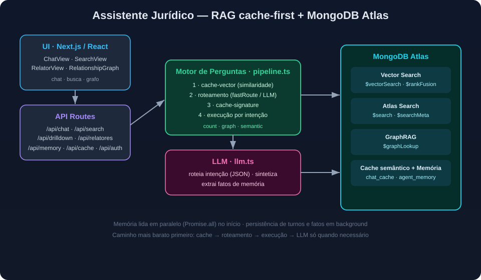

# Legal Assistant RAG — Demo (Next.js + MongoDB Atlas)

Assistente jurídico que responde perguntas sobre **jurisprudência** (acórdãos e resoluções) com **baixa latência**, combinando RAG, GraphRAG, contagens nativas e um **cache semântico** — tudo apoiado em recursos do **MongoDB Atlas**.

O diferencial da demo é a **árvore de decisão *cache-first***: cada pergunta tenta primeiro os caminhos mais baratos (cache) e só chega ao LLM quem realmente precisa, derrubando o tempo de resposta de vários segundos para a casa dos milissegundos em perguntas repetidas ou semanticamente equivalentes.

> ⚠️ Esta é uma **demo genérica**. Não acompanha dataset, credenciais ou base de dados. Você conecta seu próprio cluster Atlas e provê seu próprio conteúdo.

---

## Sumário

- [Recursos do MongoDB utilizados](#recursos-do-mongodb-utilizados)
- [Modelos de IA](#modelos-de-ia)
- [Arquitetura da aplicação](#arquitetura-da-aplicação)
- [Árvore de decisão das perguntas](#árvore-de-decisão-das-perguntas)
- [Serviços do backend](#serviços-do-backend)
- [Pré-requisitos](#pré-requisitos)
- [Configuração do MongoDB Atlas](#configuração-do-mongodb-atlas)
- [Variáveis de ambiente](#variáveis-de-ambiente)
- [Executando localmente](#executando-localmente)
- [Modelo de dados](#modelo-de-dados)
- [Índices do Atlas](#índices-do-atlas-como-funcionam)

---

## Recursos do MongoDB utilizados

| Recurso | Onde é usado | Para quê |
|---------|--------------|----------|
| **Atlas Vector Search** (`$vectorSearch`) | recuperação semântica e cache-vector | encontrar trechos/perguntas semanticamente próximos |
| **`$rankFusion`** (RRF) | busca híbrida | fundir ranking vetorial + textual num só pipeline |
| **Atlas Search** (`$search` / `$searchMeta`) | busca textual e contagens | relevância textual e contagem com filtro sem varrer documentos |
| **`$graphLookup`** | grafo de relacionamentos | conectar documentos por entidades ou por número |
| **`estimatedDocumentCount` / `$unwind` + `$group`** | contagens | totais rápidos e valores distintos |
| **Coleções de embeddings gerenciados** | chunks e cache | vetor por trecho (auto-embedding no índice) |

## Modelos de IA

A aplicação usa dois papéis de modelo, ambos acessados por um **endpoint compatível com OpenAI Chat Completions** (configurável por variável de ambiente):

- **LLM de chat/síntese** (ex.: `gpt-5.6-luna`): entende a pergunta, roteia a intenção (modo JSON), sintetiza a resposta final e extrai fatos de memória.
- **Modelo de embeddings gerenciado pelo Atlas**: gera os vetores dos chunks e das perguntas de cache diretamente no índice de busca vetorial (auto-embedding), sem chamada de embedding no código da aplicação.

O nome do modelo de chat é definido em `LLM_MODEL`; o de embeddings é configurado no **índice** do Atlas Vector Search.

## Arquitetura da aplicação



> Visão gráfica: UI → API → Motor de Perguntas (cache-first) → MongoDB Atlas, com o LLM acionado apenas quando necessário.

Fluxo lógico de uma pergunta, do usuário à resposta:

```
Usuário (pergunta)
      │
      ▼
Aplicação Web (Next.js) ── recebe e organiza a requisição (POST /api/chat)
      │
      ▼
LLM · entende a pergunta ── classifica intenção + extrai filtros (ou fastRoute sem LLM)
      │
      ▼
Motor de Perguntas (pipeline.ts) ── coordena cache, roteamento e execução
      │
      ▼
Busca no MongoDB ── Vector Search / rankFusion / graphLookup / contagem nativa
      │
      ▼
LLM · responde ── sintetiza a resposta a partir do contexto recuperado
      │
      ▼
Resposta ao usuário  (+ memória do agente persistida em background)
```

**Camadas:**

- **UI (React/Next.js)** — `ChatView`, `SearchView`, `RelatorView`, `RelationshipGraph`: chat, busca estruturada, listagem por relator e visualização de grafo.
- **API Routes** (`src/app/api/*`) — `chat`, `search`, `drilldown`, `relatores`, `memory`, `cache`, `auth`.
- **Serviços** (`src/lib/services/*`) — orquestração, roteamento, RAG, filtros, grafo, cache e memória.
- **MongoDB Atlas** — documentos, chunks (com vetores), cache semântico e memória do agente.

## Árvore de decisão das perguntas

A cada pergunta o **motor** percorre os caminhos do mais barato ao mais caro:

```
                          ┌─────────────────────────────┐
Pergunta ───────────────► │ 1. cache-vector (similaridade)│
                          └───────────────┬─────────────┘
                       HIT (≥ limiar)      │  MISS
                 replay VERBATIM (~ms) ◄────┘
                          (sem LLM)         │
                                            ▼
                          ┌─────────────────────────────┐
                          │ 2. roteamento de intenção     │
                          │  fastRoute (heurístico, 0 LLM)│
                          │  ou roteador LLM (JSON mode)  │
                          └───────────────┬─────────────┘
                                          ▼
                          ┌─────────────────────────────┐
                          │ 3. cache-signature (assinatura)│
                          │  count/graph → replay verbatim │
                          │  semantic    → re-síntese      │
                          └───────────────┬─────────────┘
                                          │  MISS
                                          ▼
                          ┌─────────────────────────────┐
                          │ 4. execução por intenção       │
                          │  count | graph | semantic      │
                          │  → síntese LLM → grava cache    │
                          └─────────────────────────────┘

Em paralelo: leitura de memória (Promise.all) no início;
persistência de turnos + extração de fatos em background (fire-and-forget).
```

**Intenções:**

- **`semantic`** (padrão) — perguntas abertas/temáticas: RAG híbrido (`$rankFusion`) + síntese LLM.
- **`count`** — quantitativos: contagem nativa (`$searchMeta` com filtro, `estimatedDocumentCount` sem filtro, `$unwind`+`$group` para distintos).
- **`graph`** — relacionamentos: `$graphLookup` a partir de uma entidade ou número de documento.

## Serviços do backend

| Arquivo | Responsabilidade |
|---------|------------------|
| `pipeline.ts` | Orquestrador (`answerQuestion`): cache-vector → roteamento → cache-signature → execução → LLM → grava cache. Memória lida em `Promise.all`; persistência em background. |
| `intent.ts` | Roteamento de intenção. `fastRoute` resolve perguntas temáticas **sem LLM**; senão usa o roteador LLM (JSON mode) para classificar `count \| graph \| semantic` e extrair filtros. |
| `rag.ts` | Recuperação híbrida com `$rankFusion` (vetorial + textual), reagrupamento por documento-pai e *fallback* por documento inteiro. |
| `filters.ts` | `buildVectorFilter` (pré-filtro do `$vectorSearch`), `buildMatch` (`$match` pós-fusão) e `runCount` (contagem nativa). |
| `graphquery.ts` | Rede de relacionamentos via `$graphLookup`. |
| `cache.ts` | Cache semântico: `lookupByVector` (replay verbatim no hit) + `lookupBySignature` (assinatura de filtros). |
| `memory.ts` | Memória do agente: curto prazo (turnos por sessão) e longo prazo (fatos por usuário). |
| `llm.ts` | Cliente do endpoint de LLM (chat completion, JSON mode, temperatura). |

## Pré-requisitos

- **Node.js 18+** e **npm**
- Uma conta **MongoDB Atlas** com um cluster (M0 gratuito serve para testar; Vector Search requer Atlas)
- Acesso a um **endpoint de LLM compatível com OpenAI Chat Completions** (URL + API key + nome do modelo)

## Configuração do MongoDB Atlas

1. **Crie um cluster** no Atlas e um usuário de banco com permissão de leitura/escrita.
2. **Libere seu IP** em *Network Access* (ou `0.0.0.0/0` apenas para testes locais).
3. **Crie o banco** (default: `legal_assistant`) e as coleções que for usar (ex.: documentos-pai e suas coleções de chunks).
4. **Crie os quatro índices de busca** (nomes esperados pelo código — detalhes em [Índices do Atlas](#índices-do-atlas-como-funcionam)):
   - `default` — **Vector Search** (auto-embedding) nas coleções de chunks, com filtros `doc_type`, `metadata.numero`, `metadata.numero_resolucao`, `metadata.ano_sessao`.
   - `fulltext` — **Atlas Search** (texto) para o lado textual do `$rankFusion`.
   - `filters` — **Atlas Search** nos documentos-pai para contagens via `$searchMeta`.
   - `cache_vec` — **Vector Search** (auto-embedding) na coleção `chat_cache` para o cache-first.
5. **Popule o conteúdo**: ingira seus documentos e gere os chunks. A aplicação espera documentos-pai e coleções de chunks correspondentes (ver [Modelo de dados](#modelo-de-dados)).

> Os nomes de banco/coleções e o modelo de embedding são configuráveis; ajuste conforme seu ambiente.

## Variáveis de ambiente

Copie `.env.example` para `.env.local` e preencha com **seus** valores. **Nunca** versione o `.env.local`.

```bash
cp .env.example .env.local
```

| Variável | Obrigatória | Default | Descrição |
|----------|-------------|---------|-----------|
| `MONGODB_URI` | ✅ | — | Connection string do cluster Atlas |
| `MONGODB_DB` | — | `legal_assistant` | Nome do banco |
| `LLM_API_URL` | ✅ | — | Endpoint de chat completions |
| `LLM_API_KEY` | ✅ | — | Chave de API do provedor de LLM |
| `LLM_MODEL` | — | `gpt-5.6-luna` | Modelo de chat/síntese |
| `RAG_USE_CHUNKS` | — | `true` | Liga a recuperação por chunks |
| `CACHE_HIT_THRESHOLD` | — | `0.80` | Limiar de similaridade do cache-vector |
| `MEMORY_COLLECTION` | — | `agent_memory` | Coleção da memória do agente |

## Executando localmente

```bash
npm install
cp .env.example .env.local   # e preencha os valores
npm run dev                  # http://localhost:3000
```

Login simulado da demo: **João / 12345** (autenticação fictícia, apenas para escopar a memória do agente — não emite token real).

Scripts disponíveis:

```bash
npm run dev     # ambiente de desenvolvimento
npm run build   # build de produção
npm run start   # sobe o build de produção
npm run lint    # lint
```

## Modelo de dados

A aplicação trabalha com dois níveis de documento: **documentos-pai** de jurisprudência (acórdãos e resoluções) e suas **coleções de chunks** vetorizados. Além dessas, há a coleção de **cache semântico** e a de **memória do agente**.

### Coleções

| Coleção | Papel | Observações |
|---------|-------|-------------|
| `acordaos` | documentos-pai (acórdãos) | texto integral + metadados estruturados |
| `resolucao` | documentos-pai (resoluções) | idem |
| `acordaos_chunks` | chunks dos acórdãos | 1 vetor por trecho (auto-embedding), referência ao pai |
| `resolucao_chunks` | chunks das resoluções | idem |
| `chat_cache` | cache semântico de perguntas | vetor da pergunta + resposta/fontes cacheadas |
| `agent_memory` | memória do agente | curto prazo (turnos/sessão) e longo prazo (fatos/usuário) |

> Os nomes das coleções são configuráveis no código (`COLLECTIONS`, `CHUNK_COLLECTIONS`, `chat_cache`, `MEMORY_COLLECTION`). Ajuste ao seu domínio.

### Exemplo de documento-pai

```json
{
  "_id": "66b0f2c1a1b2c3d4e5f60001",
  "id": 12345,
  "source": "acordao_2023_00133.pdf",
  "source_id": "AC-133/2023",
  "num_pages": 8,
  "doc_type": "acordao",
  "content": "Texto integral do acórdão...",
  "metadata": {
    "ementa": "Convênio de repasse de recursos. Prestação de contas...",
    "numero": 133,
    "numero_resolucao": null,
    "decisoes": ["aprovado com ressalvas"],
    "relatores": ["Conselheiro Fulano de Tal"],
    "interessados": ["Secretaria de Educação"],
    "processos_relacionados": ["PROC-2005-00133"],
    "unidades_jurisdicionadas": ["Fundo de Desenvolvimento da Educação"],
    "classes_subclasses": ["Convênio", "Prestação de Contas"],
    "ano_sessao": 2023,
    "data_sessao": "2023-05-10",
    "data_publicacao_doe": "2023-05-20",
    "nome_presidente": "Conselheiro Beltrano"
  }
}
```

### Exemplo de chunk

```json
{
  "_id": "66b0f2c1a1b2c3d4e5f6a001",
  "parent_oid": "66b0f2c1a1b2c3d4e5f60001",
  "source_id": "AC-133/2023",
  "doc_type": "acordao",
  "source": "acordao_2023_00133.pdf",
  "num_pages": 8,
  "chunk_index": 0,
  "n_chunks": 5,
  "content": "Trecho do acórdão usado na busca vetorial e textual...",
  "metadata": { "ementa": "...", "numero": 133, "ano_sessao": 2023 }
}
```

> O campo de embedding **não** aparece no documento: o Atlas gera e mantém o vetor **dentro do índice** (auto-embedding), a partir de `content` e `metadata.ementa`. A aplicação não calcula embeddings no código.

### Campos usados em filtros, contagens e grafo

| Campo | Usado em |
|-------|----------|
| `doc_type` | filtro de tipo (`acordao`/`resolucao`) no vetor e no texto |
| `metadata.numero` / `metadata.numero_resolucao` | pré-filtro no `$vectorSearch` e localização de documento no grafo |
| `metadata.ano_sessao` | filtro de ano (vetor e texto) |
| `metadata.relatores` | agrupamento por relator e nós do grafo |
| `metadata.interessados` | nós/arestas do grafo |
| `metadata.processos_relacionados` | relacionamentos (`$graphLookup`) |
| `metadata.unidades_jurisdicionadas` | filtro/nós do grafo |
| `metadata.classes_subclasses` | classificação temática |

## Índices do Atlas (como funcionam)

A demo depende de **quatro índices**. Crie-os pela UI do Atlas (*Atlas Search*) ou por script. Os nomes abaixo são os esperados pelo código.

| Índice | Tipo | Coleções | Para quê |
|--------|------|----------|----------|
| `default` | Vector Search (auto-embedding) | `acordaos_chunks`, `resolucao_chunks` | lado vetorial do `$rankFusion` + pré-filtros |
| `fulltext` | Atlas Search (texto) | chunks e pais | lado textual do `$rankFusion` (relevância lexical) |
| `filters` | Atlas Search | `acordaos`, `resolucao` | contagens nativas via `$searchMeta` |
| `cache_vec` | Vector Search (auto-embedding) | `chat_cache` | similaridade da pergunta (cache-first) |

### `default` — Vector Search com auto-embedding

Indexa os chunks gerando o vetor no próprio índice (sem embeddings no código) e expõe os campos de **pré-filtro** para o `$vectorSearch`:

```json
{
  "fields": [
    { "type": "autoEmbed", "path": "content", "model": "voyage-4-lite", "modality": "text" },
    { "type": "autoEmbed", "path": "metadata.ementa", "model": "voyage-4-lite", "modality": "text" },
    { "type": "filter", "path": "metadata.ano_sessao" },
    { "type": "filter", "path": "doc_type" },
    { "type": "filter", "path": "metadata.numero" },
    { "type": "filter", "path": "metadata.numero_resolucao" }
  ]
}
```

Os `filter` permitem **pré-filtrar dentro do `$vectorSearch`** (ex.: só documentos de um número/ano), evitando trazer candidatos irrelevantes antes da fusão de ranking.

### `fulltext` — Atlas Search (texto)

Índice de busca textual sobre `content` e `metadata.ementa`. É o `textPipeline` do `$rankFusion`: enquanto o vetorial captura similaridade semântica, o textual captura correspondências lexicais exatas (números, siglas, termos jurídicos). O `$rankFusion` funde os dois rankings por **Reciprocal Rank Fusion (RRF)**.

### `filters` — contagens nativas

Índice de busca sobre os documentos-pai usado por `$searchMeta` com `count: { type: "total" }`. Isso conta **pelos metadados do índice**, sem streamar os documentos, respondendo perguntas quantitativas com filtro em milissegundos. Sem filtro, a contagem usa `estimatedDocumentCount()`.

### `cache_vec` — cache-first

Vector Search com auto-embedding sobre `question_text` na coleção `chat_cache`. Cada pergunta respondida é gravada com seu vetor; a próxima pergunta faz `$vectorSearch` e, se o score ≥ `CACHE_HIT_THRESHOLD` (default `0.80`), a resposta é reproduzida **verbatim, sem chamar o LLM**.

> O modelo de embedding (`voyage-4-lite` nos exemplos) é definido **no índice**, não no código — troque-o pelo modelo gerenciado que preferir no seu Atlas.
